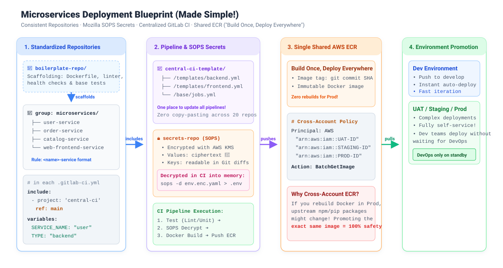

Imagine this: It’s your first week as a junior DevOps engineer or intern. You’re sitting at your desk, proudly admiring your terminal prompt. 

Your lead walks over, hands you a fresh coffee, and smiles:

> *"Welcome aboard! We have about 20 microservices—some backend APIs, some web frontends. We need to deploy them reliably across Dev, UAT, Staging, and Production. Can you make sure our pipelines are consistent and secure?"*

You nod eagerly. Then you look at the company GitLab:
- 20 different repositories.
- Some repos are named `backend_user`, some `orderService`, some `frontend-v2`.
- Someone left a `.env` file with AWS credentials inside a commit from 8 months ago.
- If you need to update Docker build flags, you’d have to edit 20 `.gitlab-ci.yml` files by hand.

Panic sets in. *Is this what DevOps really is? Just endless copy-pasting and praying on Fridays?*

Relax! Take a deep breath. Today, we’re going to walk step-by-step through how real-world engineering teams solve this, one puzzle piece at a time.

<!--more-->

---

## 🗺️ The 10,000-Foot View

Here is the simple, bird's-eye view of how our code travels from a developer's machine to a running container:



> [!TIP]
> 🎨 **Want to play with this diagram?** Download [`architecture-pipeline.excalidraw`](architecture-pipeline.excalidraw) and drop it into [excalidraw.com](https://excalidraw.com) to customize it!

Now, let's break this down by asking the right questions.

---

## Question 1: "How Do We Keep 20+ Repositories from Becoming the Wild West?"

If every developer creates repos however they like, chaos is guaranteed. 

To solve this, we establish two ground rules from Day 1:

### Rule 1: Strict, Predictable Naming
Every microservice lives under a parent GitLab group (e.g. `microservices/`) and follows a strict naming pattern:

```
microservices/
├── user-service/             # Backend
├── order-service/            # Backend
├── catalog-service/          # Backend
└── web-frontend-service/     # Frontend
```

Format: `<service-name>-service`.

Why does this matter?
Because when your CI/CD tools, GitOps controllers, and monitoring scripts can predict a service's name, you can write automation that works across all 20+ services without writing 20 custom scripts!

### Rule 2: The Boilerplate Repository (The Cookie Cutter 🍪)
Nobody starts a service from a blank folder. Instead, we maintain a `boilerplate-service` repository.

Whenever a team needs a new microservice, they scaffold from the boilerplate, which already includes:
- A standardized `Dockerfile` (multi-stage build, non-root user).
- Standard linting, testing, and formatting configs.
- A built-in `/health` check endpoint.
- An ultra-lean `.gitlab-ci.yml` (more on that soon!).

---

## Question 2: "Where Do Configuration and Secrets Live?"

Every service needs configurations (like ports, log levels) and secrets (like DB connection strings, API tokens).

- ❌ **Bad idea**: Committing plaintext `.env` files with passwords into Git. (Security will hunt you down).
- ❌ **Also bad**: Pasting 50 environment variables manually into GitLab CI web settings for 20 repos. (Drift nightmare).

### The Solution: JSON Configs & Mozilla SOPS 🔒

We define two files in each microservice repository under `deployment/<env>/` (for example, `deployment/development/`):

#### 1. `variables.json` (The Public Configs)
This file holds all non-sensitive configuration in a key-value format. It is completely safe to commit and acts as the source of truth for the service's environment.
```json
{
  "PORT": "3000",
  "LOG_LEVEL": "info",
  "AWS_REGION": "us-east-1"
}
```

#### 2. `secrets.json` (The Secret Keys)
This file holds the **keys only** (as an array). The actual sensitive values are nowhere to be found in this repo.
```json
[
  "DATABASE_PASSWORD",
  "STRIPE_API_KEY"
]
```

#### Where do the actual secret values come from?
We store the actual encrypted secret values in a central, dedicated secrets repository using [Mozilla SOPS](https://github.com/getsops/sops). SOPS encrypts the values using AWS KMS, making them safe to store in Git while leaving the keys readable in diffs.

#### How it comes together in the Pipeline:
1. The CI pipeline reads `variables.json` to get the base configuration.
2. The pipeline reads the keys from `secrets.json`.
3. It fetches the corresponding decrypted values for those keys from the central SOPS secrets repository on the fly.
4. It parses both together into a YAML file to create the final **AWS ECS Task Definition**, and deploys it!

These two JSON files act as our single source of truth for what a deployment looks like!

---

## Question 3: "Do We Rebuild Docker Images for Staging and Prod?"

Here is a trap many beginners fall into:
> *"Let's build an image for UAT. When it passes, we build it again for Staging. When that passes, we build it again for Production!"*

❌ **Never do this!** 

If you rebuild a Docker image hours or days later, an upstream dependency (like an npm package or base OS patch) might update. Your production image might behave completely differently than what QA tested in UAT!

### The Golden Rule: Build Once, Deploy Everywhere 🐳

You build the Docker container **once** during the build stage and tag it with the Git commit hash (e.g. `user-service:a1b2c3d`). That exact image digest is what gets promoted to every environment.

### But What If Staging and Production Are in Different AWS Accounts?

In enterprise AWS setups, companies use separate AWS accounts for isolation:
- AWS Account A: `Shared / CI Tooling`
- AWS Account B: `UAT`
- AWS Account C: `Staging`
- AWS Account D: `Production`

Do we push the image to 4 different registries? **No!**

We keep a **single central AWS ECR (Elastic Container Registry)** and attach an **AWS Cross-Account ECR Policy**:

```json
{
  "Version": "2012-10-17",
  "Statement": [
    {
      "Sid": "AllowOtherAccountsToPull",
      "Effect": "Allow",
      "Principal": {
        "AWS": [
          "arn:aws:iam::111122223333:root", /* UAT Account */
          "arn:aws:iam::444455556666:root", /* Staging Account */
          "arn:aws:iam::777788889999:root"  /* Production Account */
        ]
      },
      "Action": [
        "ecr:BatchGetImage",
        "ecr:GetDownloadUrlForLayer"
      ]
    }
  ]
}
```

*(Reference: [AWS Documentation on Cross-Account ECR Policies](https://docs.aws.amazon.com/AmazonECR/latest/userguide/repository-policy-examples.html))*

Now, UAT, Staging, and Production all pull the **exact same immutable Docker image** directly from the central registry. 100% confidence, 0% drift.

---

## Question 4: "How Do We Manage 20 Pipelines Without Copy-Pasting YAML?"

Now to the main event: **The GitLab CI Template Technique**.

Instead of writing 200 lines of `.gitlab-ci.yml` in 20 repositories, we create a single **Central CI Template Repository** (e.g., `infrastructure/central-ci-template`).

### Inside the Microservice: Just 8 Lines of YAML!

Here is what `.gitlab-ci.yml` looks like inside `user-service`:

```yaml
# In user-service/.gitlab-ci.yml
include:
  - project: 'infrastructure/central-ci-template'
    ref: main
    file: '/templates/backend.yml'

variables:
  SERVICE_NAME: "user"
  SERVICE_TYPE: "backend"
```

Look at that simplicity! The microservice author just tells the pipeline: *"I am the user backend service. Central pipeline, do your thing!"*

### Inside the Central Template: How the Magic Works

In our central repository, `/templates/backend.yml` defines the entire lifecycle using `extends:`:

```yaml
# In central-ci-template: /templates/backend.yml
stages:
  - test
  - secrets
  - build
  - deploy

# 1. Test Stage
unit-tests:
  stage: test
  image: node:20-alpine
  script:
    - npm ci
    - npm test

# 2. Secrets Stage
fetch-secrets:
  stage: secrets
  image: getsops/sops:v3.8-alpine
  script:
    - sops -d secrets/$SERVICE_NAME/$ENV.enc.yaml > .env
  artifacts:
    paths:
      - .env
    expire_in: 1 hour

# 3. Build & Push Stage
build-image:
  stage: build
  image: docker:24-dind
  script:
    - docker build -t $CENTRAL_ECR_REGISTRY/$SERVICE_NAME:$CI_COMMIT_SHORT_SHA .
    - docker push $CENTRAL_ECR_REGISTRY/$SERVICE_NAME:$CI_COMMIT_SHORT_SHA

# 4. Deploy Stage
deploy-ecs:
  stage: deploy
  script:
    - aws ecs update-service --cluster $ENV-cluster --service $SERVICE_NAME-service --force-new-deployment
```

### The Superpower of this Pattern
Next month, when your company wants to add security vulnerability scanning (Trivy or SonarQube) to all 20 services:
1. You edit **one file** in `central-ci-template`.
2. You commit to `main`.
3. Immediately, all 20+ microservices inherit the scanner on their next push. 

Zero merge requests across 20 repos. You just saved your entire afternoon!

---

## Question 5: "How Do We Actually Deploy This?" (Focusing on DEV)

For this guide (Part 1), we are going to focus purely on the **DEV Environment**.

### The Dev Environment Experience
In the Dev environment, speed is everything. 
When a developer pushes code to the `develop` branch, the pipeline automatically kicks off:
1. Runs unit tests and linters.
2. Parses `variables.json` and fetches secrets.
3. Builds and pushes the Docker image to ECR.
4. Updates the ECS Task Definition and deploys the container.

Within minutes, the developer's new code is live in the Dev sandbox, ready for internal integration testing.

### What about UAT, Staging, and Prod?
Deploying to higher environments (UAT, Staging, Production) involves a much more complicated process (think database migrations, cross-region deployments, and Blue/Green traffic shifting).

However, **I resolved this complexity by fully automating it**. 
The result? The development team can trigger deployments to UAT, Staging, and even Production completely on their own, fully self-service, without waiting for DevOps support! (Though as DevOps, we are always on standby to support in case something goes wrong).

We'll dive into the intricate details of how that higher-environment promotion works in Part 2!

---|---|---|---|
| **Dev** | Rapid developer sandbox | Developers | Auto-deploy on merge to `develop` |
| **UAT** | User Acceptance Testing | QA testers & product owners | Triggered by release candidate tags (`v1.2.0-rc1`) |
| **Staging** | Production dry run | DevOps & automated smoke tests | Triggered before production release |
| **Prod** | Real live traffic | End users & customers | Gated manual approval after Staging passes |

### The "Identical Twins" Principle: Staging == Prod
A common junior mistake is treating Staging as a tiny, cheap environment with different configurations. 

In a mature architecture, **Staging and Production are identical twins**:
- Same multi-AZ or multi-region ECS Fargate setup.
- Same CPU & memory allocations.
- Same load balancer health check thresholds.

If a Docker container has a memory leak or crashes under replica scaling, you want to discover that in Staging—**never in Production!**

---

## 🎯 Summary Checklist

Let's recap the principles we used to make microservices manageable:

1. **Standardize Naming**: `<service-name>-service` inside a parent `microservices/` group.
2. **Use Boilerplates**: Never start from scratch; clone a vetted template with Docker, linters, and health checks ready.
3. **Encrypt with SOPS**: Keep secrets in Git safely using [Mozilla SOPS](https://github.com/getsops/sops) and AWS KMS.
4. **Build Once, Deploy Everywhere**: Store images in a single central ECR registry and use [AWS Cross-Account Policies](https://docs.aws.amazon.com/AmazonECR/latest/userguide/repository-policy-examples.html) to share them with UAT, Staging, and Prod.
5. **Centralize GitLab CI**: Microservices only write 8 lines of YAML with `include:project` and `variables`.

---

## 🚀 What's Next? (Questions for Future Deep Dives)

Now that our pipelines are consistent and our images are safe, what challenges lie ahead?
- *What happens when a new version has a bug? How do we perform zero-downtime Blue/Green deployments on AWS ECS?*
- *How do we route traffic across multiple AWS regions for global users?*

Stay tuned for our next guide where we dive into AWS ECS Blue/Green traffic swaps and load balancer routing!

---

*Found this guide helpful? Have questions about SOPS or GitLab CI includes? Leave a comment or reach out!*


### Developer Environment Topology

I generated an interactive diagram of the CI/CD pipeline routing for the Dev environment. [**Click here to view the interactive Dev Topology Diagram**](/blogs/images/dev-topology/dev-topology.html)


### Developer Environment Topology

I generated an interactive diagram of the CI/CD pipeline routing for the Dev environment. [**Click here to view the interactive Dev Topology Diagram**](/blogs/images/dev-topology/dev-topology.html)
